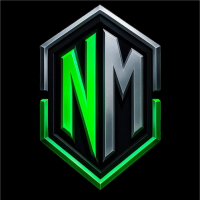

# Proyecto de Portafolio de Título  

## 📌 Contexto  
*NMCollections* es un proyecto personal de un cliente que ha estado desarrollando diseños innovadores basados en jugadores de futbol mundiales, pero tambien ha ido adaptándose al mercado de su zona y comenzó a recurrir a la creación de cartas personalizadas para sus clientes, entre estos se encuentran clubes reconocidos en nuestro país, tales como *Colo Colo*, *Palestino*, *EFC Conchali*, etc. El proyecto tiene como objetivo darse a conocer, a través de un sitio web para generar un mayor alcance y profesionalismo para nuestro cliente.

Por lo mencionado y pensando en la innovación tecnológica nuestro cliente de *NMCollections* está muy entusiasmado en desarrollar una página web para tener un perfil más atractivo dentro de este mercado, ya que como está en ascenso, y por nuestra investigación a nivel nacional sería una verdadera oportunidad de surgimiento, ya que no hay competencias reales en este tipo de negocios.
  

  

---

## 🎯 Solución Propuesta  
Se desarrolló una **página web** que:  
- Entrega una sensación de seguridad y profesionalismo al usuario.  
- Permite comprar cartas oficiales, pre-hechas o personalizadas.  
- Incluye como valor agregado la posibilidad de que los usuarios:  
  - **Creen sus propias cartas**.  
  - **Subasten sus cartas personalizadas**.  

De esta forma, NMCollections puede presentar su negocio de manera más sólida y confiable, generando mayor alcance y confianza en sus clientes.  

---

## 🛠️ Tecnologías y Herramientas  
- **Django**  
- **API de Mercado Pago**  
- **SQL**  

---

## 👨‍💻 Programadores  
- Gustavo Paredes: gu.paredes@duocuc.cl
- Jeremy Contreras: je.contrerass@duocuc.cl
- Matias Parada: m.parada@duocuc.cl

---

## 👤 Cliente  
**NMCollections**
